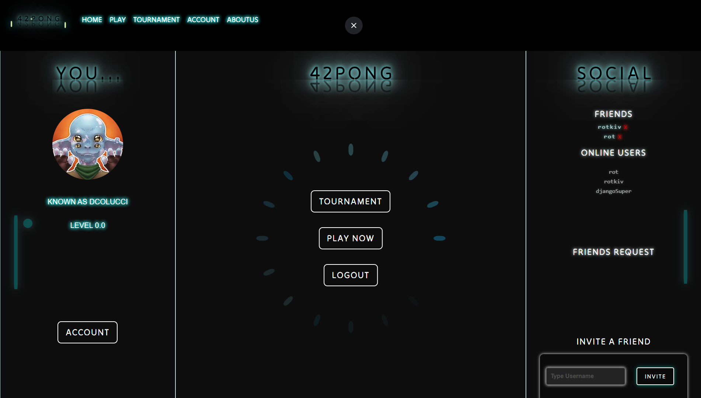

# ft_transcendence



## Introduction
Welcome to **ft_transcendence**, a cutting-edge web application that takes the classic Pong game to new heights with stunning 3D graphics and multiplayer capabilities. Built with the powerful Django framework, this project seamlessly integrates PostgreSQL for robust data management, Redis for efficient real-time communication, and Nginx for reliable web serving. Whether you're a developer looking to explore advanced web technologies or a gamer eager to experience Pong like never before, **ft_transcendence** has something for everyone. Dive in and discover the future of web-based gaming!

 
## Table of Contents
- [Overview](#overview)
- [Prerequisites](#prerequisites)
- [Setup](#setup)
    - [Clone the Repository](#clone-the-repository)
    - [Environment Variables](#environment-variables)
    - [Build and Run Containers](#build-and-run-containers)
- [Services](#services)
    - [Django](#django)
    - [Nginx](#nginx)
    - [PostgreSQL](#postgresql)
    - [Redis](#redis)
- [Accessing the Admin Panel](#accessing-the-admin-panel)
- [Stopping the Containers](#stopping-the-containers)
- [Contributing](#contributing)
- [Acknowledgements](#acknowledgements)
## Overview
This project is a containerized Django application using Docker. It includes the following components:
- **Django**: The main web application.
- **Nginx**: Serves as the gateway.
- **PostgreSQL**: Database for the Django application.
- **Redis**: Used for Django Channels.

## Prerequisites
Before you begin, ensure you have met the following requirements:
- You have installed `docker` and `docker compose`
- You have installed `make` command 
- You have a 42 API client ID and secret for OAuth integration.

# Setup

### Clone the Repository
```sh
git clone <repository-url>
cd <repository-directory>
```

### Environment Variables
Create a `.env` file in the srcs directory and add the necessary environment variables:
```
POSTGRES_DB=<your_db_name>
POSTGRES_USER=<your_db_user>
POSTGRES_PASSWORD=<your_db_password>

DJANGO_SUPERUSER_USERNAME=<djangoAdmin>
DJANGO_SUPERUSER_EMAIL=<djangoAdminMail>
DJANGO_SUPERUSER_PASSWORD=<djangoPassword>
SECRET_KEY=<Django secret key>
REDIRECT_URI=<host>/callback/
HOST=<host>

INTRA_OAUTH_CLIENT_ID=<clientID 42API> 
INTRA_OAUTH_SECRET=<secret 42API>
```
Note: you can download and run the project withouth having a 42API app but you can't login using the 42 API

### Build and Run Containers with make
```sh
make
```
or
```sh
cd srcs
docker compose up --build
```

## Services

### Django
- Accessible through nginx at `https://localhost:443/` or `http://localhost/`
- Main application code is in the `srcs/services/django/srcs/` directory.

### Nginx
- Acts as a reverse proxy.
- Accessible at `http://localhost/`

### PostgreSQL
- Database service.
- Accessible within the Docker network as `postgres`.

### Redis
- Used for Django Channels.
- Accessible within the Docker network as `redis`.

## Accessing the Admin Panel
- Go to `http://localhost/admin`
- Login with the superuser credentials.

## Stopping the Containers
```sh
make stop
```
or
```sh
cd srcs
docker compose down
```
## Contributing

We welcome contributions from the community. Here are our co-authors:

- **Alessio Greci** - [alegrecii](https://github.com/alegrecii)
- **Ivana Ragusa** - [IvanaRagusa](https://github.com/IvanaRagusa)
- **Victor Guidoni** - [Rotkiv97](https://github.com/Rotkiv97)
- **Manuel Di Paolo** - [mdipaol](https://github.com/mdipaol)
- **Damiano Colucci** - [Coluyanson](https://github.com/Coluyanson)

If you would like to contribute, please fork the repository and submit a pull request. For major changes, please open an issue first to discuss what you would like to change.

Please make sure to update tests as appropriate.

## Acknowledgements
- [Django](https://www.djangoproject.com/)
- [Docker](https://www.docker.com/)
- [Nginx](https://www.nginx.com/)
- [PostgreSQL](https://www.postgresql.org/)
- [Redis](https://redis.io/)
